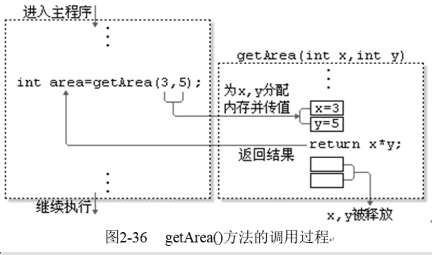
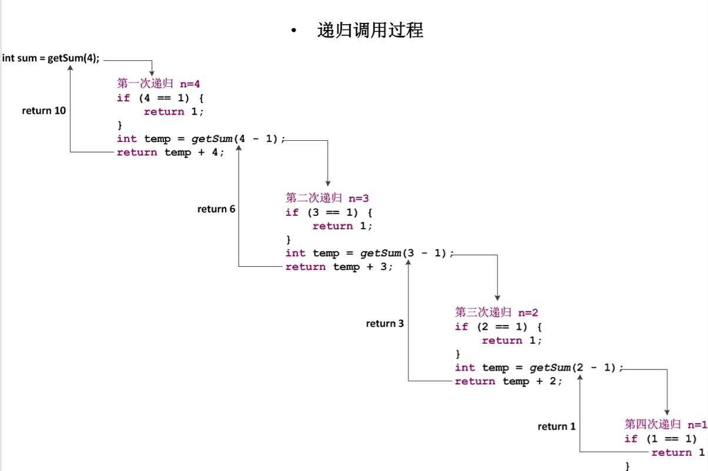

# 方法
### 什么是方法
- 在Java中，声明一个方法的具体语法格式如下：
```
修饰符  返回值类型  方法名([参数类型 参数名1 , 参数类型 参数名2 , ... ...]) {
    执行语句;
    ... ...;
    return 返回值;
}
```
- 有返回值情况:
```
public class Example {
    public static void main(String[] args) {
        int ares = getArea(3,5); //调用getArea方法
        System.out.println("The area is " + area);
    }
    //定义一个求矩形面积的方法,接受两个参数,X为高,Y为宽
    public static int getArea(int x , int y) {
        int temp = x * y; //使用变量temp存储运算结果
        return temp;      //将变量temp的值返回
    }
}

```


### 方法的调用方式
- 方法没有返回值,方法调用作为一个单独的语句。例：`printRectangle();`
- 方法有返回值,方法调用应出现在表达式中，方法调用语句可以当作是一个数值。例：`int area = getArea(3,5);`

### 参数的传递
```
int c = 5;
int x = getSum(c);
```
- 在定义方法是方法名后面括号中的变量名称为形式参数
- 在调用一个方法时，方法名后面括号中的参数称为实际参数
- 无参方法,调用方法时不必给出参数
- 有参方法,调用方法时，要给出参数。在调用方法和被调用方法之间有数据传递。
```
无参数无返回值的方法定义：
static void printHello() {
    System.out.println("Hello");
}
方法调用：
printHello();
```
```
有参数无返回值的方法定义：
static void printStar(int number) {
    for (int i = 1 ; i <= number ; i++) {
        System.out.println("*");
    }
}
方法调用：
printStar(5);
```
```
无参数有返回值的方法定义：
static int getSum() {
    int sum = 0;
    for (int i = 1 ; i <= 10 ; i++) {
        sum = sum + i;
    }
    return sum;
}
方法调用：
int value = getSum();
```
```
有参数有返回值的方法定义：
static int getSum(int number) {
    int sum = 0;
    for (int i = 1 ; i <= number ; i++) {
        sum = sum + i;
    }
    return sum;
}
方法调用：
int value = getSum(20);
```
### 方法的嵌套调用
- 方法之间可以互相调用,并且可以嵌套调用，也就是在调用一个方法的过程中，又调用另一个方法。
```
public class test1 {
    public static void main(String[] args) {
        double x = 3.0 , y = 5.0;
        System.out.println(add(x , y));
    }
    static double add(double a , double b) {
        double result = (a + b);
        haha();
        return result;
    }
    static void haha() {
        System.out.println("haha");
    }
}
```
### 方法的递归调用
- 在调用一个方法的过程中出现直接或间接的调用该方法本身，称为方法的递归调用。
- 方法的递归是指在一个方法的内部调用自身的过程，递归必须要有结束条件，不然就会陷入无限递归的状态，永远无法结束调用。
```
public class Example {
    public static void main(String[] args) {
        int sum = getSum(4);        //调用递归方法，获得1~4的和
        System.out.println("sum = " + sum);     //打印结果
    }
    //下面的方法使用递归实现求1~的和
    public static int getSum(int n) {
        if (n == 1) {
            //满足条件，递归结束
            return 1;
        }
        int temp = getSum(n - 1);
        return temp + n
    }
}
```

```
public class test2 {
    public static void main(String[] args) {
        int x = 10;
        int f10 = fibonacci(10);
        System.out.println("F10 = " + f10);
    }
    static int fibonacci(int n) {
        if (n == 1 || n == 2) {
            return 1;
        } else {
            return fibonacci(n - 1) + fibonacci(n - 2);
        }
    }
}
```